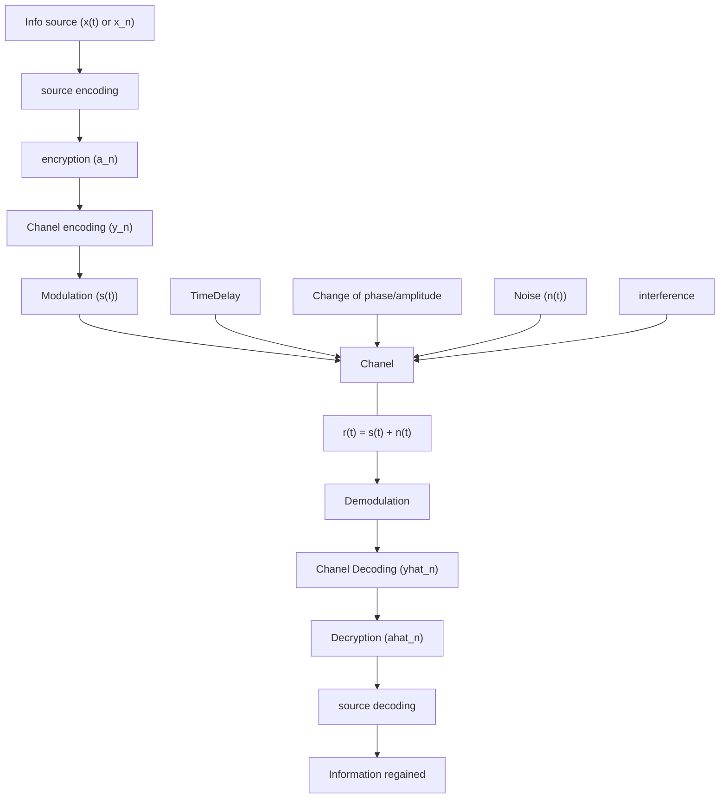

In digital coms we turn bits into predefined signals called [[Symbol]] and we transmit those instead. There are many ways for this conversion: #TODO 

Some performance metrics:

- [[SNR]]  
- [[SINR]] 
- [[BER]]
- [[Power Efficiency]]
- [[Spectral Efficiency]]
- [[Bit Rate]]
- [[Outage Probability]]

Information is carried through a specific course, the general idea is:

- Source: the output of a keyboard
- Source Encoding: compression
- Chanel Encoding: encode with an error correction pattern
- [[Modulation]]: turn a bitstream into [[Symbol]]

This subject is essentially a study of [[modulation]] and [[Symbol|symbol]] selection.